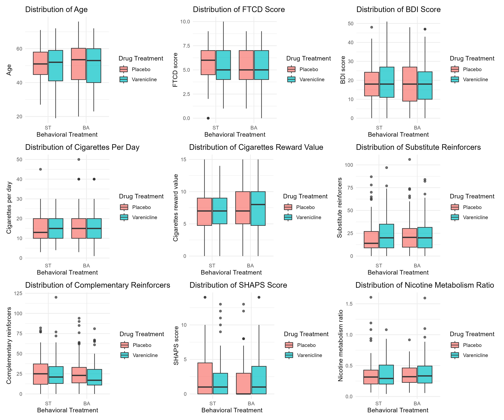
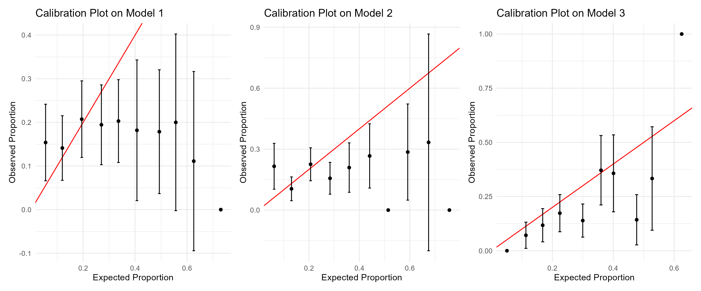

## Introduction

Smoking cessation remains a formidable challenge, particularly for individuals with major depressive disorder (MDD), who are more likely to smoke heavily, display stronger nicotine dependence, and experience severe withdrawal symptoms. These difficulties are compounded by depression-related psychological factors, which can amplify the rewards of nicotine and reduce motivation to abstinence. To address these issues, a randomized, placebo-controlled, 2x2 factorial study examined the effects of Behavioral Activation for Smoking Cessation (BASC) versus standard treatment (ST), along with adjunctive varenicline versus placebo, among adult smokers with current or past MDD [@hitsman2023efficacy]. The study aimed to assess whether behavioral and pharmacological interventions could enhance smoking cessation rates in this high-risk population.

The findings from this study indicated that while varenicline—a widely used pharmacotherapy for smoking cessation—was effective in improving abstinence rates relative to placebo, BASC alone did not outperform standard behavioral treatment, regardless of whether varenicline was used. These results suggest that while pharmacotherapy can aid smoking cessation in individuals with MDD, researchers found no evidence that BASC was more effective than ST in increasing cessation.

This project aims to build upon these findings by examining baseline variables as potential moderators of the effects of behavioral treatment on end-of-treatment (EOT) abstinence, and evaluating baseline variables as predictors of abstinence while controlling for behavioral treatment and pharmacotherapy. By identifying these moderators, the project seeks to enhance our understanding of how behavioral activation might promote smoking cessation, especially for adults with MDD, and provide insights into tailoring treatment strategies to improve success rates among this vulnerable population.


```{r setup, include=FALSE}
# Rmarkdown setting
knitr::opts_chunk$set(echo = F)
knitr::opts_chunk$set(warning = F)
knitr::opts_chunk$set(message = F)
#knitr::opts_chunk$set(eval = F)

setwd("D:/Brown/2024fall/Course/PHP2550 Practical Data Analysis/Portfolio/Project2")
```


```{r warning=FALSE, message=FALSE, echo=FALSE}
# Loading packages
library(tidyverse)
library(VIM)
library(gtsummary)
library(kableExtra)
library(corrplot)
library(glmnet)
library(pROC)
library(randomForest)
library(knitr)
library(mice)
library(naniar) # test if data missingness belongs to MCAR
library(patchwork) # Combine plots
```


```{r include=FALSE}
# Loading data
dat = read.csv("project2.csv")
dim(dat)
length(unique(dat$id))
colnames(dat)
```


## Methods

### Study setting and population

The study was a randomized, placebo-controlled, 2x2 factorial trial conducted at research clinics in Northwestern University and the University of Pennsylvania. It aimed to assess the efficacy and safety of BASC combined with varenicline for adults with current or past MDD. Participants included **300** adult smokers who had smoked daily (>=1 cigarette per day) and had a lifetime diagnosis of MDD without psychotic features. Eligible individuals expressed an interest in quitting smoking and underwent both initial and final eligibility screening, including informed consent, randomization, and a baseline assessment at intake (week 0). Randomization assigned participants to one of four arms: BASC with varenicline, BASC with placebo, ST with varenicline, and ST with placebo. 

A total of 25 variables, including a column for participant ID, were collected in this study. Smoking abstinence is our primary outcome of interest. Varenicline and Behavioral Activation (BA) are the pharmacotherapy and psychotherapy treatments, respectively. Demographic variables include age, sex, race, ethnicity, income, and education.

Smoking-related baseline variables include the Fagerstrom Test for Cigarette Dependence (FTCD) score, which measures the level of nicotine dependence (high scores indicate greater dependence), whether participants smoke within 5 minutes of waking up, cigarettes per day, cigarette reward value, scores on the pleasurable events scale for substitute and complementary reinforcers, nicotine metabolism ratio (NMR) (high ratio indicates greater dependence), exclusive menthol cigarette uses, and baseline readiness to quit smoking.

Mental health-related baseline variables include the Beck Depression Inventory (BDI) score, which assesses the severity of depressive symptoms, Snaith-Hamilton Pleasure Scale (SHAPS) score, which measures anhedonia, whether participants have any other DSM-5 diagnosis (i.e., other mental health disorders), whether they are taking antidepressant medication, and whether they currently have major depressive disorder (MDD).


### Data processing

We treated the following variables as numeric: age, FTCD score, BDI score, cigarettes per day, cigarette reward value, substitute reinforcers, complementary reinforcers, SHAPS score, and nicotine metabolism ratio. All other variables were treated as categorical, among which income, education, and readiness to quit smoking were treated as ordinal. To avoid having too small a sample size in certain categories, we combined some categories within the variable education and within the variable readiness to quit smoking.

We split the data into a training set and a test set for future model evaluation. Specifically, 70% of participants were randomly selected for the training set, while the remaining 30% were allocated to the test set. This data splitting was performed before imputing missing values, and multiple imputation needed to be conducted seperately on training set and test set.


```{r}
dat = dat %>% 
  select(-id) %>%
  mutate(abst = factor(abst, levels = c(0, 1), labels = c("No", "Yes")),
         Var = factor(Var, levels = c(0, 1), 
                      labels = c("Placebo", "Varenicline")),
         BA = factor(BA, levels = c(0, 1), labels = c("ST", "BA")),
         age_ps = as.numeric(age_ps),
         sex_ps = factor(sex_ps, levels = c(1, 2), labels = c("Male", "Female")),
         NHW = factor(NHW, levels = c(0, 1), labels = c("No", "Yes")),
         Black = factor(Black, levels = c(0, 1), labels = c("No", "Yes")),
         Hisp = factor(Hisp, levels = c(0, 1), labels = c("No", "Yes")),
         inc = factor(inc, levels = 1:5, 
                      labels = c("Less than $20,000",
                                  "$20,000–35,000",
                                  "$35,001–50,000",
                                  "$50,001–75,000",
                                  "More than $75,000"), ordered=T), #ordinal
         edu = factor(edu, levels = 1:5, 
                      labels = c("Grade School",
                                  "Some High School",
                                  "High School Graduate/GED",
                                  "Some College/Technical School", 
                                  "College Graduate"), ordered=T), #ordinal
         ftcd_score = as.integer(ftcd_score),
         ftcd.5.mins = factor(ftcd.5.mins, levels = c(0, 1), labels = c("No", "Yes")),
         bdi_score_w00 = as.integer(bdi_score_w00),
         cpd_ps = as.integer(cpd_ps),
         crv_total_pq1 = as.integer(crv_total_pq1),
         hedonsum_n_pq1 = as.integer(hedonsum_n_pq1),
         hedonsum_y_pq1 = as.integer(hedonsum_y_pq1),
         shaps_score_pq1 = as.integer(shaps_score_pq1),
         otherdiag = factor(otherdiag, levels = c(0, 1), labels = c("No", "Yes")),
         antidepmed = factor(antidepmed, levels = c(0, 1), labels = c("No", "Yes")),
         mde_curr = factor(mde_curr, levels = c(0, 1), labels = c("No", "Yes")),
         NMR = as.numeric(NMR),
         Only.Menthol = factor(Only.Menthol, levels = c(0, 1), labels = c("No", "Yes")),
         readiness = factor(readiness, levels = 3:10, ordered=T)) %>% #ordinal
  mutate(edu = fct_collapse(edu, "Some High School or below" = 
                              c("Grade School", "Some High School"))) %>%
  mutate(readiness = fct_collapse(readiness, "Below 6" = c("3", "4", "5"),
                                  "Above 8" = c("9", "10")))
```


```{r}
# Split into training set and test set
set.seed(1)
train_indices = sample(nrow(dat), size = round(0.7 * nrow(dat)))
dat_train = dat[train_indices, ]
dat_test = dat[-train_indices, ]
```


### Exploratory data analysis

Since this study is a 2x2 factorial trial, we then examined the distribution of participant characteristics across the different intervention groups. As shown in the table, we can learn the mean (SD) for continuous variables, and n (proportion%) for categorical variables. Aside from education level, there were no significant differences in the distribution of other variables among the groups.


```{r}
# Prepare for Summary table for participants in different intervention groups
label_table_summary = list(
  age_ps ~ "Age",
  sex_ps ~ "Sex",
  NHW ~ "Non-Hispanic White",
  Black ~ "Black",
  Hisp ~ "Hispanic",
  inc ~ "Income",
  edu ~ "Education",
  ftcd_score ~ "FTCD score",
  ftcd.5.mins ~ "Smoking with 5 mins of waking up",
  bdi_score_w00 ~ "BDI score",
  cpd_ps ~ "Cigarettes per day",
  crv_total_pq1 ~ "Cigarette reward value",
  hedonsum_n_pq1 ~ "Substitute reinforcers",
  hedonsum_y_pq1 ~ "Complementary reinforcers",
  shaps_score_pq1 ~ "SHAPS score (Anhedonia)",
  otherdiag ~ "Other lifetime DSM-5 diagnosis",
  antidepmed ~ "Taking antidepressant medication",
  mde_curr ~ "Current MDD",
  NMR ~ "Nicotine Metabolism Ratio",
  Only.Menthol ~ "Exclusive Mentholated Cigarette User",
  readiness ~ "Readiness to quit smoking")

# Summary table for participants in different intervention groups
table_summary = dat %>%
  mutate(
    group = case_when(
      Var == "Placebo" & BA == "ST" ~ "placebo + ST",
      Var == "Placebo" & BA == "BA" ~ "placebo + BASC",
      Var == "Varenicline" & BA == "ST" ~ "varenicline + ST",
      Var == "Varenicline" & BA == "BA" ~ "varenicline + BASC")) %>%
  select(-c(abst,Var,BA)) %>% 
  tbl_summary(
    by = group,
    missing = "no",
    label = label_table_summary,
    statistic = list(
      all_continuous() ~ "{mean} ({sd})",
      all_categorical() ~ "{n} ({p}%)")
  ) %>%
  add_p(all_categorical() ~ "chisq.test") %>%
  bold_labels() %>%
  modify_header(label = "**Variables**") %>%
  modify_caption("Participant Characteristics Summary Table") %>%
  as_kable()
  #footnote(
  #  general = "Mean (SD) for continuous variables; n (%) for categorical variables."
  #)
table_summary
```


We checked the correlation between continuous variables in our data. The correlation between each pair of variables is computed using all complete pairs of observations on those variables. In the correlation plot, we found that FTCD score at baseline and Cigarettes per day at baseline phone survey have strong positive correlation (0.5), so is BDI score at baseline and SHAPS score (Anhedonia) (0.39). A relative strong negative correlation is found between BDI score at baseline and Pleasurable Events Scale at baseline – substitute reinforcers (-0.32).


```{r fig.cap="Correlation Plot", fig.width = 7, fig.height = 7}
# Correlation Plot
continuous_vars = dat[, c("age_ps", "ftcd_score", "bdi_score_w00", "cpd_ps", 
                          "crv_total_pq1", "hedonsum_n_pq1", "hedonsum_y_pq1", 
                          "shaps_score_pq1", "NMR")] 
cor_matrix = cor(continuous_vars, use="pairwise.complete.obs")
corrplot(
  cor_matrix,
  method = "color",
  col = colorRampPalette(c("blue", "white", "red"))(200),
  type = "lower",
  addCoef.col = "black",
  tl.col = "black",
  #tl.srt = 0,
  diag = FALSE
)
```


We also explored the distribution of each variable in 4 groups. For categorical variables, the distribution (proportion) of each category can be learned from the summary table. For continuous variables, as shown in Figure2, there is no evident difference among the variable distributions in 4 groups.

```{r include=FALSE}
# The distribution of continuous variables in 4 groups
# age
p1.1 = dat %>%
  ggplot(aes(x = BA, y = age_ps, fill = Var)) +
  geom_boxplot(alpha = 0.7, position = position_dodge(0.8)) +
  labs(
    title = "Distribution of Age",
    x = "Behavioral Treatment",
    y = "Age",
    fill = "Drug Treatment"
  ) +
  theme_minimal()

# FTCD scores
p1.2 = dat %>%
  ggplot(aes(x = BA, y = ftcd_score, fill = Var)) +
  geom_boxplot(alpha = 0.7, position = position_dodge(0.8)) +
  labs(
    title = "Distribution of FTCD Score",
    x = "Behavioral Treatment",
    y = "FTCD score",
    fill = "Drug Treatment"
  ) +
  theme_minimal()

# BDI scores
p1.3 = dat %>%
  ggplot(aes(x = BA, y = bdi_score_w00, fill = Var)) +
  geom_boxplot(alpha = 0.7, position = position_dodge(0.8)) +
  labs(
    title = "Distribution of BDI Score",
    x = "Behavioral Treatment",
    y = "BDI score",
    fill = "Drug Treatment"
  ) +
  theme_minimal()

# Cigarettes Per Day
p1.4 = dat %>%
  ggplot(aes(x = BA, y = cpd_ps, fill = Var)) +
  geom_boxplot(alpha = 0.7, position = position_dodge(0.8)) +
  labs(
    title = "Distribution of Cigarettes Per Day",
    x = "Behavioral Treatment",
    y = "Cigarettes per day",
    fill = "Drug Treatment"
  ) +
  theme_minimal()

#Cigarettes Reward Value
p1.5 = dat %>%
  ggplot(aes(x = BA, y = crv_total_pq1, fill = Var)) +
  geom_boxplot(alpha = 0.7, position = position_dodge(0.8)) +
  labs(
    title = "Distribution of Cigarettes Reward Value",
    x = "Behavioral Treatment",
    y = "Cigarettes reward value",
    fill = "Drug Treatment"
  ) +
  theme_minimal()

#Substitute reinforcers
p1.6 = dat %>%
  ggplot(aes(x = BA, y = hedonsum_n_pq1, fill = Var)) +
  geom_boxplot(alpha = 0.7, position = position_dodge(0.8)) +
  labs(
    title = "Distribution of Substitute Reinforcers",
    x = "Behavioral Treatment",
    y = "Substitute reinforcers",
    fill = "Drug Treatment"
  ) +
  theme_minimal()

#Complementary reinforcers
p1.7 = dat %>%
  ggplot(aes(x = BA, y = hedonsum_y_pq1, fill = Var)) +
  geom_boxplot(alpha = 0.7, position = position_dodge(0.8)) +
  labs(
    title = "Distribution of Complementary Reinforcers",
    x = "Behavioral Treatment",
    y = "Complementary reinforcers",
    fill = "Drug Treatment"
  ) +
  theme_minimal()

#SHAPS score
p1.8 = dat %>%
  ggplot(aes(x = BA, y = shaps_score_pq1, fill = Var)) +
  geom_boxplot(alpha = 0.7, position = position_dodge(0.8)) +
  labs(
    title = "Distribution of SHAPS Score",
    x = "Behavioral Treatment",
    y = "SHAPS score",
    fill = "Drug Treatment"
  ) +
  theme_minimal()

#Nicotine Metabolism Ratio
p1.9 = dat %>%
  ggplot(aes(x = BA, y = NMR, fill = Var)) +
  geom_boxplot(alpha = 0.7, position = position_dodge(0.8)) +
  labs(
    title = "Distribution of Nicotine Metabolism Ratio",
    x = "Behavioral Treatment",
    y = "Nicotine metabolism ratio",
    fill = "Drug Treatment"
  ) +
  theme_minimal()

p1 = (p1.1 | p1.2 | p1.3) /
     (p1.4 | p1.5 | p1.6) /
     (p1.7 | p1.8 | p1.9)

#ggsave("Distribution of continuous variables.png", p1, width = 12, height = 10)
```





### Missing values

```{r include=FALSE}
# Investigate missing data
apply(dat,2,function(x) sum(is.na(x)))
sum(complete.cases(dat))

# MCAR test
#mcar_test(dat)

# Visualize missingness
#vis_miss(dat)
```

We began by assessing the extent of missing data. Nicotine Metabolism Ratio had the highest proportion of missing data, with 21 cases missing (7%). This was followed by Cigarette Reward Value at baseline, with 18 missing cases (6%), and Baseline Readiness to Quit Smoking, with 17 missing cases (5.7%). For all other variables with missing data, the number of missing cases was no more than 3. In total, 59 participants (19.7%) had missing data. No specific missing data pattern was identified. It's possible that the data is missing completely at random (MCAR). However, given the high data missing rate, proceeding with further analysis using only the 241 complete cases may result in a substantial loss of information and a decrease in statistical power. Thus, we applied the Multiple Imputation by Chained Equations (MICE) to impute missing values using **mice** package in R [@vanBuuren2011].

We first applied MICE to our original data set, performing multiple imputations with 5 imputations and 5 iterations. Different types of data were matched with appropriate imputation methods. We used the **predictive mean matching (PMM)** method for numeric variables, imputing FTCD score, SHAPS score, cigarette reward value, and nicotine metabolism ratio. For binary variables (factors with 2 levels), we applied **logistic regression (logreg)** imputation, imputing the variable exclusive mentholated cigarette user. For ordered categorical variables (factors with more than 2 levels), we used the **proportional odds model (polr)** for imputation, imputing income and readiness to quit smoking. Then we applied MICE to our training set and test set, separately, and each performing multiple imputations with 5 imputations and 5 iterations.

MICE involves three stages: imputation, analysis, and pooling. For the 5 imputed datasets generated from the original data set, we will fit a model separately to each dataset and obtain 5 sets of model parameter estimates. For each parameter (coefficient), we will calculate the average across the 5 estimated values and regard it as the overall parameter estimate. Similarly, for the 5 imputed data sets generated from the training set, we will fit a model separately to each data set. Each fitted model will then be applied to its corresponding imputed test set, resulting in 5 fitted models being applied to 5 imputed test sets. We will discuss this further in the modeling section.


```{r include=FALSE}
# MICE to original data set
dat1 = mice(dat, m = 5, seed = 123)


# MICE to training and testing data set
dat_train1 = mice(dat_train, m = 5, seed = 123)
dat_test1 = mice(dat_test, m = 5, seed = 123)

```


### Model derivation

The goal of the study is to examine baseline variables as potential moderators of the effects of behavioral treatment on abstinence, and to evaluate baseline variables as predictors of abstinence while controlling for behavioral treatment and pharmacotherapy. Thus, variable selection techniques and the addition of interaction terms between baseline variables and behavioral treatment need to be considered in model building.

Since our primary outcome of interest is binary, our model is structured based on logistic regression. We first conducted Logistic LASSO regression with L1 regularization using the **glmnet** package in R [@glmnet1] [@glmnet2] [@glmnet3]. **Model 1** was created by applying LASSO to all variables without adding interaction terms. This model aims to roughly identify which variables are important and retained in the model. **Model 2** was then built using LASSO, incorporating all variables along with the interactions between BASC and all smoking-related and mental health-related variables, as well as the interactions between Varenicline and all smoking-related and mental health-related variables. This model is intended to examine baseline variables as potential moderators. By comparing the two models, we can assess the impact of adding interaction terms on the model results.

To account for nonlinearity and potential interactions, we also applied random forest using the **randomForest** package in R [@RF]. **Model 3** was created by building a random forest with all variables without adding interaction terms on purpose. 

Since we used MICE to address missingness, as discussed in the previous section, the overall coefficient estimates for Logistic LASSO is the average of the estimates from the 5 imputed data sets. For random forest, an overall random forest can also be obtained by aggregating random forests from the 5 imputed data sets, by using the combine() function in the randomForest package in R.


### Model performance

To evaluate the models, we need to use the imputed training sets and imputed test sets. For Logistic LASSO, we applied this method to each imputed training set. Then applying each fitted model to a corresponding imputed test set. By aggregating all the predicted outcome values and true outcome values from the 5 imputed test sets, we can obtain an AUC value. For Model 1 and 2, cross-validation was used to determine the optimal $\lambda$ for each logistic LASSO regression. 

For random forest, the first step is similar --- we applied this method to each imputed training set. Then we aggregated the 5 random forest models to get a overall random forest model. Combining the 5 imputed test sets together (viewing it as one test set), we applied the overall random forest model to this combined test sets. Furthermore, for Model 3, we used the default settings for the random forest parameters: the number of trees grown was set to 500, the minimum size of terminal nodes was 1 for the classification problem, and the number of variables randomly sampled as candidates at each split was $\sqrt{p}$, where $p$ is the number of variables. We also obtained importance plots from Model 3.


## Results

### Logistic LASSO regression

```{r}
# Model 1 --- overall coef
dat1_list = lapply(1:5, function(i) complete(dat1, i))

m1_coef_list = list()

set.seed(1)
for (i in 1:5) {
  X = model.matrix(abst ~ ., data = dat1_list[[i]])[, -1]
  Y = dat1_list[[i]]$abst
  cv.lasso = cv.glmnet(X, Y, alpha = 1, family = "binomial")
  best.lambda = cv.lasso$lambda.min
  lasso.coef = coef(cv.lasso, s = best.lambda)
  
  m1_coef_list[[i]] = data.frame(
    Variable = rownames(lasso.coef),
    Coefficient = as.vector(lasso.coef)
  )
}

m1_coef_combined = Reduce(function(x, y) full_join(x, y, by = "Variable"), m1_coef_list)

m1_coef = m1_coef_combined %>%
  rowwise() %>%
  mutate(Average_Coefficient = mean(c_across(starts_with("Coefficient")), na.rm = TRUE)) %>%
  mutate(Average_Coefficient = round(Average_Coefficient, 3)) %>%
  select(Variable, Average_Coefficient) 
```


```{r}
# Model 2 --- overall coef
m2_coef_list = list()

set.seed(1)
for (i in 1:5) {
  X = model.matrix(
  abst ~ 
    # Intervention
    BA + Var + 
    # Demographic
    age_ps + sex_ps + NHW + Black + Hisp + inc + edu +
    # Smoking-related variables  
    ftcd_score + ftcd.5.mins + cpd_ps + crv_total_pq1 + hedonsum_n_pq1 + 
    hedonsum_y_pq1 + NMR + Only.Menthol + readiness + 
    # Mental Health related variables
    bdi_score_w00 + shaps_score_pq1 + otherdiag + antidepmed + mde_curr +
    # Interaction terms with BA
    BA:ftcd_score + BA:ftcd.5.mins + BA:cpd_ps + BA:crv_total_pq1 + 
    BA:hedonsum_n_pq1 + BA:hedonsum_y_pq1 + BA:NMR + BA:Only.Menthol +  
    BA:readiness + 
    BA:bdi_score_w00 + BA:shaps_score_pq1 + BA:otherdiag + 
    BA:antidepmed + BA:mde_curr + 
    # Interaction terms with Var
    Var:ftcd_score + Var:ftcd.5.mins + Var:cpd_ps + Var:crv_total_pq1 + 
    Var:hedonsum_n_pq1 + Var:hedonsum_y_pq1 + Var:NMR + Var:Only.Menthol +  
    Var:readiness + 
    Var:bdi_score_w00 + Var:shaps_score_pq1 + Var:otherdiag + 
    Var:antidepmed + Var:mde_curr,
  data = dat1_list[[i]])[, -1]
  Y = dat1_list[[i]]$abst
  cv.lasso = cv.glmnet(X, Y, alpha = 1, family = "binomial")
  best.lambda = cv.lasso$lambda.min
  lasso.coef = coef(cv.lasso, s = best.lambda)
  
  m2_coef_list[[i]] = data.frame(
    Variable = rownames(lasso.coef),
    Coefficient = as.vector(lasso.coef)
  )
}

m2_coef_combined = Reduce(function(x, y) full_join(x, y, by = "Variable"), m2_coef_list)

m2_coef = m2_coef_combined %>%
  rowwise() %>%
  mutate(Average_Coefficient = mean(c_across(starts_with("Coefficient")), na.rm = TRUE)) %>%
  mutate(Average_Coefficient = round(Average_Coefficient, 3)) %>%
  select(Variable, Average_Coefficient) 
```


```{r}
# Model 1 train and test
dat_train1_list = lapply(1:5, function(i) complete(dat_train1, i))
dat_test1_list = lapply(1:5, function(i) complete(dat_test1, i))

m1_pred_test_list = list()
m1_true_test_list = list()

set.seed(1)
for (i in 1:5) {
  train_data <- dat_train1_list[[i]]
  test_data <- dat_test1_list[[i]]
  
  X_train <- model.matrix(abst ~ ., data = train_data)[, -1]
  Y_train <- train_data$abst
  
  X_test <- model.matrix(abst ~ ., data = test_data)[, -1]
  Y_test <- test_data$abst
  
  cv.lasso <- cv.glmnet(X_train, Y_train, alpha = 1, family = "binomial")
  best_lambda <- cv.lasso$lambda.min
  fitted_model <- glmnet(X_train, Y_train, alpha = 1, lambda = best_lambda, family = "binomial")
  
  predicted_probs <- predict(fitted_model, X_test, type = "response")
  m1_pred_test_list[[i]] <- predicted_probs
  m1_true_test_list[[i]] = Y_test
}

m1_pred_test = do.call(rbind, m1_pred_test_list) %>% as.vector()
m1_true_test = do.call(rbind, m1_true_test_list) %>% as.vector()

roc.m1 = roc(m1_true_test, m1_pred_test)
auc.m1 = auc(roc.m1)
```


```{r}
# Model 2 train and test
m2_pred_test_list = list()
m2_true_test_list = list()

set.seed(1)
for (i in 1:5) {
  train_data <- dat_train1_list[[i]]
  test_data <- dat_test1_list[[i]]

  X_train <- model.matrix(
  abst ~ 
    # Intervention
    BA + Var + 
    # Demographic
    age_ps + sex_ps + NHW + Black + Hisp + inc + edu +
    # Smoking-related variables  
    ftcd_score + ftcd.5.mins + cpd_ps + crv_total_pq1 + hedonsum_n_pq1 + 
    hedonsum_y_pq1 + NMR + Only.Menthol + readiness + 
    # Mental Health related variables
    bdi_score_w00 + shaps_score_pq1 + otherdiag + antidepmed + mde_curr +
    # Interaction terms with BA
    BA:ftcd_score + BA:ftcd.5.mins + BA:cpd_ps + BA:crv_total_pq1 + 
    BA:hedonsum_n_pq1 + BA:hedonsum_y_pq1 + BA:NMR + BA:Only.Menthol +  
    BA:readiness + 
    BA:bdi_score_w00 + BA:shaps_score_pq1 + BA:otherdiag + 
    BA:antidepmed + BA:mde_curr + 
    # Interaction terms with Var
    Var:ftcd_score + Var:ftcd.5.mins + Var:cpd_ps + Var:crv_total_pq1 + 
    Var:hedonsum_n_pq1 + Var:hedonsum_y_pq1 + Var:NMR + Var:Only.Menthol +  
    Var:readiness + 
    Var:bdi_score_w00 + Var:shaps_score_pq1 + Var:otherdiag + 
    Var:antidepmed + Var:mde_curr,
  data = train_data)[, -1]
  Y_train <- train_data$abst
  
  X_test <- model.matrix(
  abst ~ 
    # Intervention
    BA + Var + 
    # Demographic
    age_ps + sex_ps + NHW + Black + Hisp + inc + edu +
    # Smoking-related variables  
    ftcd_score + ftcd.5.mins + cpd_ps + crv_total_pq1 + hedonsum_n_pq1 + 
    hedonsum_y_pq1 + NMR + Only.Menthol + readiness + 
    # Mental Health related variables
    bdi_score_w00 + shaps_score_pq1 + otherdiag + antidepmed + mde_curr +
    # Interaction terms with BA
    BA:ftcd_score + BA:ftcd.5.mins + BA:cpd_ps + BA:crv_total_pq1 + 
    BA:hedonsum_n_pq1 + BA:hedonsum_y_pq1 + BA:NMR + BA:Only.Menthol +  
    BA:readiness + 
    BA:bdi_score_w00 + BA:shaps_score_pq1 + BA:otherdiag + 
    BA:antidepmed + BA:mde_curr + 
    # Interaction terms with Var
    Var:ftcd_score + Var:ftcd.5.mins + Var:cpd_ps + Var:crv_total_pq1 + 
    Var:hedonsum_n_pq1 + Var:hedonsum_y_pq1 + Var:NMR + Var:Only.Menthol +  
    Var:readiness + 
    Var:bdi_score_w00 + Var:shaps_score_pq1 + Var:otherdiag + 
    Var:antidepmed + Var:mde_curr,
  data = test_data)[, -1]
  Y_test <- test_data$abst
  
  cv.lasso <- cv.glmnet(X_train, Y_train, alpha = 1, family = "binomial")
  best_lambda <- cv.lasso$lambda.min
  fitted_model <- glmnet(X_train, Y_train, alpha = 1, lambda = best_lambda, family = "binomial")
  
  predicted_probs <- predict(fitted_model, X_test, type = "response")
  m2_pred_test_list[[i]] <- predicted_probs
  m2_true_test_list[[i]] = Y_test
}

m2_pred_test = do.call(rbind, m2_pred_test_list) %>% as.vector()
m2_true_test = do.call(rbind, m2_true_test_list) %>% as.vector()

roc.m2 = roc(m2_true_test, m2_pred_test)
auc.m2 = auc(roc.m2)
```


```{r}
# Show Model 1 and Model 2 Results
m1_coef_brief = m1_coef %>% filter(Average_Coefficient != 0 )
m2_coef_brief = m2_coef %>% filter(Average_Coefficient != 0 )
merged.lasso.coef.df =
  full_join(m1_coef_brief, m2_coef_brief, by = "Variable") %>%
  rename(
    `Model 1` = Average_Coefficient.x,
    `Model 2` = Average_Coefficient.y) %>%
  mutate(Variable = recode(Variable,
    "VarVarenicline" = "Varenicline",
    "NHWYes" = "Non-Hispanic White",
    "ftcd_score" = "FTCD score",
    "shaps_score_pq1" = "SHAPS score",
    "mde_currYes" = "Current MDD",
    "BABA:ftcd_score" = "BA:FTCD score ",
    "BABA:Only.MentholYes" = "BA:Only.Menthol",
    "BABA:readiness.C" = "BA:readiness.C",
    "BABA:readiness^4" = "BA:readiness^4",
    "VarVarenicline:ftcd.5.minsYes" = "Varenicline:smoke with 5 mins wake up",
    "VarVarenicline:crv_total_pq1" = "Varenicline:cigarettes reward value",
    "VarVarenicline:NMR" = "Varenicline:NMR",
    "VarVarenicline:Only.MentholYes" = "Varenicline:Only.Menthol",
    "VarVarenicline:readiness.L" = "Varenicline:readiness.L"
    ))

merged.lasso.coef.df %>%
  kbl(caption = "Coefficients for Lasso Model 1 and Model 2") %>%
  kable_styling(
    bootstrap_options = c("striped", "hover", "condensed"),
    full_width = F,
    position = "center"
  )
```


As shown in Table 3, which presents the coefficient tables for Models 1 and 2, we observed that in Model 1, the coefficients for Varenicline (1.066), Non-Hispanic White indicator (0.345), FTCD score at baseline (-0.154), Anhedonia (-0.005), Current MDD (-0.114), Nicotine Metabolism Ratio (0.347), the quadratic trend of education (0.001) and the fourth order of readiness to quit smoking (0.068) were not eliminated by LASSO. Model 2 has similar significant variables, with the exclusion of Nicotine Metabolism Ratio. Notably, the coefficient for Varenicline decreased substantially from 1.066 in Model 1 to 0.304 in Model 2, while changes in the coefficients for other variables were minimal. Most interaction terms were eliminated in Model 2, with a few remaining: BASC with FTCD score at baseline (-0.016), BASC with exclusive mentholated cigarette user (-0.047), BASC with both the cubic and the fourth order of readiness to quit smoking, Varenicline with Smoking within 5 minutes of waking up (0.418), Varenicline with Nicotine Metabolism Ratio (1.271), Varenicline with exclusive mentholated cigarette user (0.076), and Varenicline with the linear trend of readiness to quit smoking (-0.201).

Based on these results, we can conclude that Varenicline is an important predictor (present in both models), whereas BASC appears to be less relevant (with a coefficient of 0 in both models). This is consistent with the conclusions in the article. The effect of Varenicline on abstinence may be moderated by Smoking within 5 minutes of waking up, cigarettes reward value, Nicotine Metabolism Ratio, exclusive mentholated cigarette user, and readiness to quit smoking, all of which are smoking-related variables. Non-Hispanic White status, FTCD score at baseline, and Current MDD status may be important predictors for abstinence; specifically, being Non-Hispanic White, having a low FTCD score at baseline, or not currently having MDD may contribute positively to abstinence. Anhedonia might also play a role in abstinence, though its effect is minor (the absolute value of coefficient less than 0.02 in both models). Additionally, baseline FTCD score, exclusive mentholated cigarette user, and readiness to quit smoking may act as a moderator for BASC.


The original article stated that "BA was predicted to increase abstinence by addressing anhedonia, especially in individuals with current MDD." However, we observed no significant patterns related to it in Model 1 or Model 2. To further investigate, we conducted an exploratory analysis. As shown in Figure 2, one finding is that the group without BASC but who achieved abstinence had very low SHAPS scores. This may suggest that a low baseline SHAPS score (indicating lower levels of anhedonia) could contribute to abstinence without the need for BASC, which aligns with the conclusion in the original article. However, to explore the relationship among BASC, anhedonia, and abstinence more thoroughly, we may need longitudinal data on anhedonia after treatment, as this might better reveal the impact of BASC.


```{r fig.cap = "Impact of Behavioral Activation on Anhedonia by Abstinence Status", fig.width = 5.5, fig.height = 3, eval=FALSE}
# Plot Anhedonia vs. BA by Abstinence Status
dat %>%
  filter(mde_curr == "Yes") %>% 
  ggplot(aes(x = BA, y = shaps_score_pq1, fill = abst)) +
  geom_boxplot(alpha = 0.7, position = position_dodge(0.8)) +
  labs(
    title = "Impact of Behavioral Activation on Anhedonia by Abstinence Status",
    x = "Behavioral Activation (BA)",
    y = "Anhedonia (SHAPS score)",
    fill = "Abstinence"
  ) +
  theme_minimal()
```


### Random Forest

Figure 3 shows the importance plot for random forest. Foucusing on the mean decrease accuracy measurement, Varenicline and FTCD score at baseline are the most important variables, then follows Cigarettes per day at baseline, readiness to quit smoking, Nicotine Metabolism ratio, and SHAPS score, but they do not have significant difference in importance than others.


```{r include=FALSE}
# Random Forest Model m3
# dat1_list = lapply(1:5, function(i) complete(dat1, i))

m3_list <- vector("list", length(dat1_list))

set.seed(1)
for (m in seq_along(dat1_list)) {
  m3_list[[m]] <- randomForest(
    x = dat1_list[[m]][,
   # Intervention
   c("BA","Var", 
   # Demographic
   "age_ps", "sex_ps", "NHW", "Black", "Hisp", "inc", "edu",
   # Smoking-related variables  
   "ftcd_score", "ftcd.5.mins", "cpd_ps", "crv_total_pq1", "hedonsum_n_pq1", 
   "hedonsum_y_pq1", "NMR", "Only.Menthol", "readiness", 
   # Mental Health related variables
   "bdi_score_w00", "shaps_score_pq1", "otherdiag", "antidepmed", "mde_curr")],
    y = dat1_list[[m]]$abst,
    #data = dat1_list[[m]],
    keep.forest = TRUE,
    importance = TRUE
  )
}

m3_combined = randomForest::combine(m3_list[[1]], m3_list[[2]], m3_list[[3]],
                                    m3_list[[4]], m3_list[[5]])
```


```{r fig.cap = "Variable Importance Plot without Interactions", fig.width = 8, fig.height = 8}
rf.m3.imp = varImpPlot(m3_combined, main="Model 3 - RF")
```


```{r include=FALSE}
# Random Forest Model m3 train and test
m3_train_list <- vector("list", length(dat_train1_list))

set.seed(1)
for (m in seq_along(dat_train1_list)) {
    m3_train_list[[m]] <- randomForest(
    x = dat_train1_list[[m]][,
   # Intervention
   c("BA","Var", 
   # Demographic
   "age_ps", "sex_ps", "NHW", "Black", "Hisp", "inc", "edu",
   # Smoking-related variables  
   "ftcd_score", "ftcd.5.mins", "cpd_ps", "crv_total_pq1", "hedonsum_n_pq1", 
   "hedonsum_y_pq1", "NMR", "Only.Menthol", "readiness", 
   # Mental Health related variables
   "bdi_score_w00", "shaps_score_pq1", "otherdiag", "antidepmed", "mde_curr")],
    y = dat_train1_list[[m]]$abst,
    keep.forest = TRUE,
    importance = TRUE
  )
}

m3_train_combined = randomForest::combine(m3_train_list[[1]], 
                                          m3_train_list[[2]], 
                                          m3_train_list[[3]],
                                          m3_train_list[[4]], 
                                          m3_train_list[[5]])

m3_test <- do.call(rbind, dat_test1_list)

m3_test_pred <- predict(m3_train_combined, newdata = m3_test, type = "prob")[, 2]

m3_test_true = m3_test$abst

roc.m3 <- roc(m3_test_true, m3_test_pred)
```


### ROC Plots

The three ROC plots are shown together in Figure 4. Model 3 achieves the highest AUC value of 0.707 (0.646, 0.768). Models 2 and 1 have similar poor AUC values, at 0.535 (0.465, 0.605) and 0.524 (0.456, 0.591), respectively. Random Forest significantly improves the model performance.

```{r fig.cap="ROC Plot", fig.width = 6, fig.height = 6, echo=FALSE}
# ROC Plot
plot(1 - roc.m1$specificities, roc.m1$sensitivities, 
     xlim = c(0, 1), ylim = c(0, 1),
     las = 1, type = "l", lwd = 2, col = "blue",
     main = "ROC Curves for Multiple Models", 
     xlab = "1 - Specificity", ylab = "Sensitivity")

abline(0, 1, lty = 2, col = "gray")
lines(1 - roc.m2$specificities, roc.m2$sensitivities, 
      col = "red", lwd = 2)
lines(1 - roc.m3$specificities, roc.m3$sensitivities, 
      col = "green", lwd = 2)


text(0.65,0.2, paste0("Lasso Model 1 AUC = ", 
                      formatC(roc.m1$auc, format="f", digits=3), 
                      " (", formatC(ci(roc.m1)[1], format="f", digits=3),
                      ", ", formatC(ci(roc.m1)[3], format="f", digits=3),
                      ")"))
text(0.65,0.15, paste0("Lasso Model 2 AUC = ", 
                       formatC(roc.m2$auc, format="f", digits=3), 
                       " (", formatC(ci(roc.m2)[1], format="f", digits=3),
                      ", ", formatC(ci(roc.m2)[3], format="f", digits=3), 
                      ")"))
text(0.65,0.10, paste0("RF Model 3 AUC = ", 
                       formatC(roc.m3$auc, format="f", digits=3),
                       " (", formatC(ci(roc.m3)[1], format="f", digits=3),
                      ", ", formatC(ci(roc.m3)[3], format="f", digits=3),
                      ")"))

legend("right", legend = c("Model 1", "Model 2", "Model 3"),
       col = c("blue", "red", "green"), lwd = 2)
```


### Calibration Plots

```{r include=FALSE}
# Calibration
num_cuts <- 10
calib_m1 <-  data.frame(prob = m1_pred_test,
                            bin = cut(m1_pred_test, breaks = num_cuts),
                            class = m1_true_test-1)
calib_m1 <- calib_m1 %>% 
                group_by(bin) %>% 
                summarize(observed = sum(class)/n(), 
                          expected = sum(prob)/n(), 
                          se = sqrt(observed * (1-observed) / n()))
calib_m2 <-  data.frame(prob = m2_pred_test,
                            bin = cut(m2_pred_test, breaks = num_cuts),
                            class = m2_true_test-1)
calib_m2 <- calib_m2 %>% 
                group_by(bin) %>% 
                summarize(observed = sum(class)/n(), 
                          expected = sum(prob)/n(), 
                          se = sqrt(observed * (1-observed) / n()))

calib_m3 <-  data.frame(prob = m3_test_pred,
                            bin = cut(m3_test_pred, breaks = num_cuts),
                            class = as.numeric(m3_test_true)-1)
calib_m3 <- calib_m3 %>% 
                group_by(bin) %>% 
                summarize(observed = sum(class)/n(), 
                          expected = sum(prob)/n(), 
                          se = sqrt(observed * (1-observed) / n()))
```


```{r include=FALSE}
p2.1 = ggplot(calib_m1) + 
  geom_abline(intercept = 0, slope = 1, color = "red") + 
  geom_errorbar(aes(x = expected, ymin = observed - 1.96 * se, 
                    ymax = observed + 1.96 * se), 
                colour="black", width=.01)+
  geom_point(aes(x = expected, y = observed)) +
  labs(x = "Expected Proportion", y = "Observed Proportion",
       title = "Calibration Plot on Model 1") +
  theme_minimal()

p2.2 = ggplot(calib_m2) + 
  geom_abline(intercept = 0, slope = 1, color = "red") + 
  geom_errorbar(aes(x = expected, ymin = observed - 1.96 * se, 
                    ymax = observed + 1.96 * se), 
                colour="black", width=.01)+
  geom_point(aes(x = expected, y = observed)) +
  labs(x = "Expected Proportion", y = "Observed Proportion",
       title = "Calibration Plot on Model 2") +
  theme_minimal()

p2.3 = ggplot(calib_m3) + 
  geom_abline(intercept = 0, slope = 1, color = "red") + 
  geom_errorbar(aes(x = expected, ymin = observed - 1.96 * se, 
                    ymax = observed + 1.96 * se), 
                colour="black", width=.01)+
  geom_point(aes(x = expected, y = observed)) +
  labs(x = "Expected Proportion", y = "Observed Proportion",
       title = "Calibration Plot on Model 3") +
  theme_minimal()

p2 = (p2.1 | p2.2 | p2.3)

#ggsave("Calibration Plots.png", p2, width = 12, height = 5)
```



From the calibration plots, we can learn that  there exists **overestimation** of the probability of abstinence in Model 1, Model 2 and Model 3. For very small probability of abstinence, there exists underestimation in Model 1 and Model 2.


## Discussion

This study aimed to identify baseline variables as potential moderators of behavioral treatment effects on smoking abstinence and to evaluate these variables as predictors of abstinence while controlling for both behavioral treatment and pharmacotherapy. We constructed two logistic LASSO models --- one with interaction terms and one without, and a random forest model. 

Our results showed that certain baseline factors, such as FTCD score, Non-Hispanic White ethnicity, and readiness to quit smoking, may play significant roles in predicting abstinence, and that Varenicline’s effectiveness might be moderated by some smoking-related factors, like Smoking within 5 minutes of waking up, cigarettes reward value, Nicotine Metabolism Ratio, exclusive mentholated cigarette user, and readiness to quit smoking. These findings align with the original article’s conclusions, particularly regarding Varenicline’s role as a key predictor of abstinence.

We found that FTCD score, exclusive mentholated cigarette user and readiness to quit smoking may be a moderator of behavioral treatment effects on smoking abstinence. However, the moderating effects of other mental health-related variables were not significant. Additionally, we found that BASC did not contribute as much as expected to abstinence, which aligns with the conclusions in the article.

The article states th at BASC might improve abstinence by addressing anhedonia, especially in individuals with current MDD, our models did not reveal significant interactions between BA and anhedonia. This may suggest that the relationship among BA, anhedonia, and abstinence is complex and may require additional data for deeper exploration. Specifically, longitudinal measurements of anhedonia after treatment may be needed to fully understand the role of BASC.

The logistic LASSO regression model may be limited by its linear structure, even with the inclusion of interaction terms. Both AUC values from Model 1 and Model 2 are low. By incorporating interaction terms, the random forest model offers a more flexible structure. Its much higher AUC value demonstrates the improved performance. However, a drawback of using random forest is the difficulty in obtaining precise quantitative estimates of predictor effects, and the difficulty in interpretation. Furthermore, all the three models overestimate the probability of abstinence.

One of the limitations of this project is that we only considered interactions between BASC or Varenicline and other smoking-related or mental health-related variables. There may be important interactions between other variables that were not included. The statistical power may not be high enough if we add more interactions given the limited sample size. Our random forest model partially addresses this limitation by capturing complex interactions automatically.


## Conclusion

This analysis highlights the importance of FTCD score as a baseline predictor of abstinence while controlling for behavioral treatment and pharmacotherapy. The analysis also confirms Varenicline’s significance in promoting abstinence among smokers with MDD. However, the anticipated effect of BASC on abstinence, potentially through anhedonia, was not evident, indicating a need for further research. We found that FTCD score, exclusive mentholated cigarette user, and readiness to quit smoking may moderate the effects of behavioral treatment on smoking abstinence, while several baseline smoking-related variables may moderate the effects of pharmacotherapy on abstinence. 


\pagebreak


## References

::: {#refs}
:::


